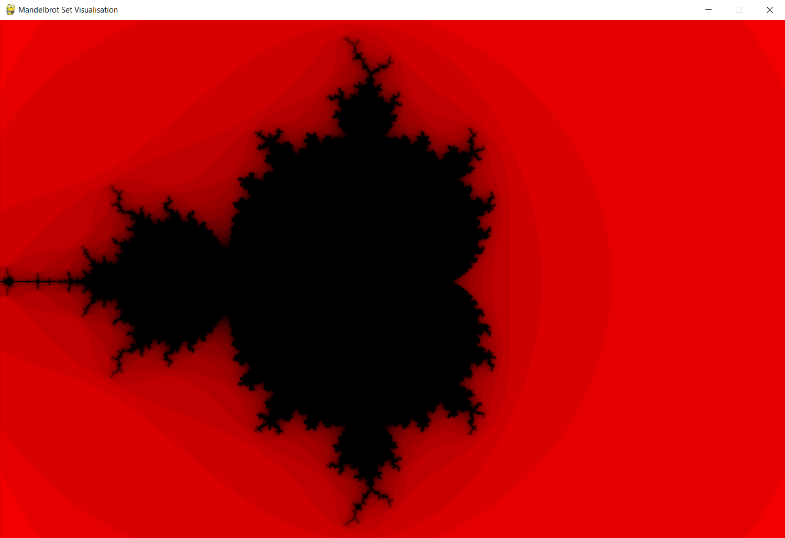

# Mandeldraw
Mandelbrot and multibrot set visualisations in Python using Pygame.

- Standard Mandelbrot set recursive function
- Ability to provide custom multibrot functions
- Modify settings of drawing
- Point transformations
